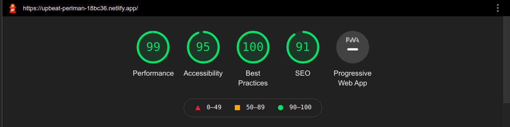

# Eleventy Template

A minimalist Portfolio and Blog template made with [11ty](https://www.11ty.dev/), [tailwindcss](https://tailwindcss.com/) and [Snowpack](https://www.snowpack.dev/). Some features of this template are,

-   Blog post generation from markdown files.
-   Posts have,
    -   Tags
    -   Time of publication
    -   Read time
    -   Embedded Images and Videos
-   Pagination
-   HTML and CSS Minification and Purge
-   Lazy-loading Images
-   RSS Feed
-   Sitemap

## Lighthouse Score



## How to use?

-   **To run locally** in dev environment,

```bash
git clone https://github.com/amitkbiswas01/eleventy-template.git
cd eleventy-template
npm install
npm run serve
```

-   **To build for production**, after running `npm install`, run `npm build`. This will generate a `dist` folder in the root directory. This `dist` folder can be directly uploaded to sites like Netlify or Now.sh or used for github pages.

-   **Other commands** include,
    -   `npm run prettier` : for prettier formatting
    -   `npm run clean` : for removing `dist` folder
    -   `npm run debug` : for debugging

## Attributes

[About Page Photo by pikisuperstar](https://www.freepik.com/vectors/technology)
